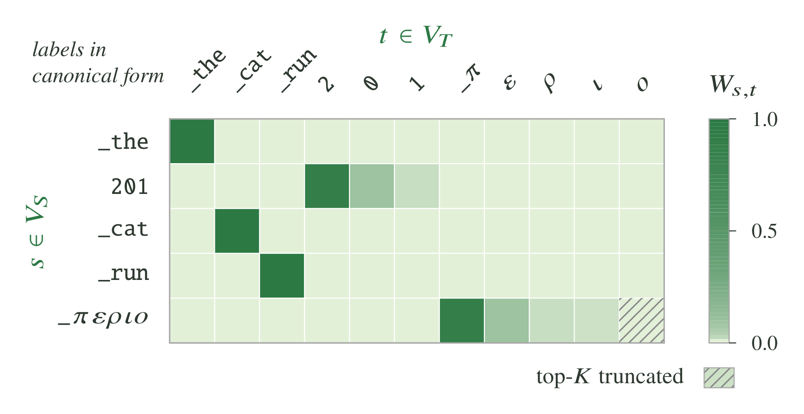

# Cross-Tokenizer (X-Token) Off-Policy Distillation

NeMo RL supports off-policy distillation between a student and a teacher that
**do not share a tokenizer** — for example, distilling a Qwen3-4B teacher into
a Llama-3.2-1B student. Cross-tokenizer ("x-token") distillation aligns the
student and teacher token sequences, then compares distributions over
corresponding token events. V6 can derive those relationships entirely from
forward and reverse **subtoken tables**, without a projection matrix.
Matrix-derived common-vocabulary support remains supported.

Tokenizer vocabularies overlap only partially, so their token relationships
must be mapped. The table below reports the pairwise overlap
(intersection divided by the smaller vocabulary, on canonical token forms)
across several model tokenizers; the off-diagonal entries sit well below
`1.0`.

| Model | Mistral-NeMo-Minitron-8B | Qwen3-8B-Base | Llama-3.2-1B | gemma-3-4b-it | OLMo2-8B-SuperBPE-t160k | gpt-oss-20b |
|---|---:|---:|---:|---:|---:|---:|
| Mistral-NeMo-Minitron-8B | 1.0000 | 0.5119 | 0.5525 | 0.7430 | 0.4215 | 0.7591 |
| Qwen3-8B-Base | 0.5119 | 1.0000 | 0.8481 | 0.6320 | 0.4103 | 0.6462 |
| Llama-3.2-1B | 0.5525 | 0.8481 | 1.0000 | 0.6739 | 0.4980 | 0.7977 |
| gemma-3-4b-it | 0.7430 | 0.6320 | 0.6739 | 1.0000 | 0.4918 | 0.6545 |
| OLMo2-8B-SuperBPE-t160k | 0.4215 | 0.4103 | 0.4980 | 0.4918 | 1.0000 | 0.3657 |
| gpt-oss-20b | 0.7591 | 0.6462 | 0.7977 | 0.6545 | 0.3657 | 1.0000 |

This guide explains how to:

1. Create the projection matrix from a (student, teacher) tokenizer pair.
2. Launch distillation with the projection matrix, or use existing subtoken
   tables for [matrix-free v6](#matrix-free-v6-with-subtoken-tables).
3. Choose a supported backend and [teacher transport](#native-mcore-sparse-transport).

## How it works

A run using a projection matrix has two phases. The three prep steps are *offline data prep* —
small CLI tools you run once per (student, teacher) pair — and the result is a
single `.pt` file. The final step is the actual distillation training loop.

```
                        ┌──────────────────────────────────────────────┐
                        │  Offline projection-matrix preparation       │
                        │                                              │
                        │  ┌────────────────────────────────────┐      │
  (student, teacher)    │  │ 1. minimal_projection_via_         │      │
  tokenizers       ────▶│  │    multitoken.py                   │      │
                        │  │    — multi-token mappings          │      │
                        │  └─────────────────┬──────────────────┘      │
                        │                    │                         │
                        │  ┌─────────────────▼──────────────────┐      │
                        │  │ 2. reapply_exact_map.py            │      │
                        │  │    — pin exact 1-to-1 matches      │      │
                        │  └─────────────────┬──────────────────┘      │
                        │                    │                         │
                        │  ┌─────────────────▼──────────────────┐      │
                        │  │ 3. sort_and_cut_projection_matrix  │      │
                        │  │    .py — trim to runtime top_k     │      │
                        │  └─────────────────┬──────────────────┘      │
                        └────────────────────│─────────────────────────┘
                                             │
                                             ▼  projection_matrix.pt
                        ┌────────────────────────────────────────────────────┐
                        │  4. examples/                                      │
                        │     run_xtoken_off_policy_distillation.py          │
                        │     — align student & teacher tokens, then         │
                        │       teacher forward + student forward,           │
                        │       then x-token KD loss                         │
                        └────────────────────────────────────────────────────┘
```

The projection artifact stores sparse relationships between student and teacher
tokens. Current v6 derives its common-token map from these relationships, or
from subtoken tables in matrix-free mode. Mismatch partitions use prefix
alternatives rather than a dense multiplication of student logits by the matrix.



Each row of the matrix holds the weights `W_{s,t}` that distribute a student
token `s ∈ V_S` over the teacher tokens `t ∈ V_T` it corresponds to. Tokens
shared by both vocabularies map 1-to-1 (e.g., `_the`, `_cat`, `_run`), while a
student token that the teacher splits into pieces spreads its weight across
those pieces (e.g., `201` → `2`, `0`, `1`). Rows are trimmed to the runtime
`top_k` in Step 3, so low-weight tail entries are dropped (hatched cell).

## Quickstart — single command

For the typical case, `tools/x_token/build_projection_matrix.sh` chains
the prep steps with auto-derived intermediate paths:

```bash
./tools/x_token/build_projection_matrix.sh \
    --student-model meta-llama/Llama-3.2-1B \
    --teacher-model Qwen/Qwen3-4B \
    --runtime-top-k 4
```

The wrapper writes the final matrix to
`cross_tokenizer_data/projection_matrix_<student>_<teacher>_top<N>.pt`
(override with `--final-output`). Further tweaks to step 1 defaults can be configured using `--no-{scale-trick,reverse-pass,special-token-mapping}`. Run `./tools/x_token/build_projection_matrix.sh
--help` for the full list of options.

The per-step recipes below are for advanced customization (non-default
weight thresholds, hand-picked intermediate filenames, etc.).

## Backend and scope

X-token supports Megatron-Core and the existing DTensor routes. Teachers and the
student share one colocated Ray GPU pool and run serially: each teacher exports
its logits and offloads its model, then the student consumes every teacher's
payload. Producers retain reusable storage across successful steps. The controller
releases it at the enclosing train or validation scope exit, after all student
consumers have completed. Teacher parameter offload does not release these payloads.

CUDA IPC is node-local. Every teacher/student pair must satisfy the placement,
DP-sample, and TP/CP compatibility checks; equal global GPU counts alone are not
sufficient. On multiple nodes, both policies must use PP1. There is no remote-Ray
fallback for tensor storage.

The native MCore student path requires PP1, static batches, and disabled sequence
packing. A native sparse MCore teacher has the same restrictions. Each loss uses
the original MCore CP rows, including both zigzag segments, with global next-token
labels. Native sparse-only, same-tokenizer-only, and their mixture avoid a student
full-sequence logits relayout. A retained legacy consumer can request one shared
contiguous compatibility view. The dense teacher producer may still rearrange
its own rows.

| Teacher route | Export | Student behavior |
|---|---|---|
| MCore cross-tokenizer, `teacher_topk_ipc_k > 0` | Native sparse row support, exact log-normalizer, realized-label sidecars | Native sparse KD on a static, unpacked MCore PP1 student |
| DTensor-V2 cross-tokenizer, `teacher_topk_ipc_k > 0` | Reusable sparse slabs published by TP0 | Retained reconstructed-sparse consumer; can coexist with native MCore sparse teachers |
| Cross-tokenizer, `teacher_topk_ipc_k = 0` | Contiguous dense export; reusable CUDA slabs for eligible static MCore pairs | Retained dense cross-tokenizer consumer |
| Same-tokenizer, any `teacher_topk_ipc_k` | Dense export | Native row reads when student and teacher satisfy the MCore envelope; otherwise the existing dense consumer |

Teacher selection and dynamic teacher weights remain available for supported
dense-only runs. For true same-tokenizer `averaged_logits`, a teacher set that
mixes native-capable MCore and legacy exporters stays entirely on the existing
dense route so logits remain position-aligned. Other supported dense/DTensor
paths retain their established behavior. The Megatron split training API does
not support x-token; use ordinary `Policy.train` and validation.

## Step 1 — Build multi-token mappings

Many student tokens (e.g., `"12"`) tokenize into multiple teacher tokens
(e.g., `"1"`, `"2"`). `minimal_projection_via_multitoken.py` walks the
student vocab, re-tokenizes each token with the teacher tokenizer, and adds
weighted entries to the projection. With `--enable-reverse-pass` it also
does the symmetric teacher → student walk.

```bash
uv run python -m tools.x_token.minimal_projection_via_multitoken \
    --student-model "meta-llama/Llama-3.2-1B" \
    --teacher-model "Qwen/Qwen3-4B" \
    --top-k 32 \
    --enable-scale-trick \
    --enable-reverse-pass \
    --enable-special-token-mapping
```

Output: `cross_tokenizer_data/projection_map_Llama-3.2_to_Qwen3_multitoken_top_32_double_special.pt`.

Pass `--num-examples 50` to print a sample of student→teacher mappings after
the matrix is built — useful for spot-checking that special tokens, numerals,
and punctuation map to sensible teacher tokens.

## Step 2 — Reapply exact-token map

Tokenizers built with a similar algorithm (for example, BPE) typically share
a sizable set of identical tokens — common punctuation, single ASCII
characters, and frequent subwords. `reapply_exact_map.py` pins those
overlapping tokens to 1-to-1 mappings with weight 1.0, overwriting whatever
Step 1 produced for them.

```bash
uv run python -m tools.x_token.reapply_exact_map \
    --student-model "meta-llama/Llama-3.2-1B" \
    --teacher-model "Qwen/Qwen3-4B" \
    --initial-projection-path cross_tokenizer_data/projection_map_Llama-3.2_to_Qwen3_multitoken_top_32_double_special.pt
```

Output is written next to the input as `<basename>_exact_map_remapped.pt`.

## Step 3 — Sort and trim to runtime `top_k`

We observe the projection map is very sparse — each student token maps to at most 4–5
teacher tokens. This step sorts each row by weight, trims to the chosen
runtime `top_k`, and stores the result as a sparse `[V_student, top_k]`
representation (per-row indices plus weights). That sparse format avoids materializing a computationally
expensive dense projection matrix of size `[student_vocab, teacher_vocab]` during distillation.

```bash
uv run python -m tools.x_token.sort_and_cut_projection_matrix \
    --initial-projection-path cross_tokenizer_data/projection_map_Llama-3.2_to_Qwen3_multitoken_top_32_double_special_exact_map_remapped.pt \
    --top_k 4 \
    --output_path cross_tokenizer_data/projection_matrix_llama_qwen_top4.pt
```

## Step 4 — Launch x-token distillation

The training entrypoint is `examples/run_xtoken_off_policy_distillation.py` with the
exemplar config at `examples/configs/xtoken_off_policy_distillation.yaml`. The exemplar
defaults to Llama-3.2-1B (student) ← Qwen3-4B (teacher) and the v6
prefix-bidir partition loss. For data it points `data.train.data_files` at the ungated, CC-BY-4.0
NVIDIA **Nemotron-Pretraining-Specialized-v1.1** corpus
(`Nemotron-Pretraining-Formal-Logic` subset) over `hf://`, so the recipe runs
out of the box with no auth or extra setup. The `projection_matrix_path` below
points at the `cross_tokenizer_data/` directory that Steps 1–3 create, so run
those first (or the `build_projection_matrix.sh` wrapper). Override paths via
Hydra CLI:

```bash
uv run python examples/run_xtoken_off_policy_distillation.py \
    --config examples/configs/xtoken_off_policy_distillation.yaml \
    teachers.0.aligner.projection_matrix_path=cross_tokenizer_data/projection_matrix_llama_qwen_top4.pt \
    cluster.gpus_per_node=8 \
    cluster.num_nodes=1
```

The exemplar explicitly sets `teachers[0].is_cross_tokenizer: true` and keeps
`aligner.projection_matrix_path: null` so artifact paths can be supplied for
each tokenizer pair. Its default `loss_fn.common_indices_from_subtoks: false`
requires a projection path; the table-based configuration below does not.
`data.train.data_files`
already points at the default NVIDIA corpus described above; override it only
to train on your own `.arrow`/`.parquet`/`.json`/`.txt` corpus.

### Matrix-free v6 with subtoken tables

Select tokenizer mode independently of the projection artifact with
`teachers[i].is_cross_tokenizer`:

| Value | Behavior |
|---|---|
| `true` | Align student and teacher token sequences and use cross-tokenizer v6 loss. |
| `false` | Reuse matching token positions and use same-tokenizer direct KL. Cross-tokenizer artifact paths must be unset. |
| Omitted or `null` | Preserve legacy inference: a configured projection path selects cross-tokenizer mode; no path selects same-tokenizer mode. |

For table-based v6, set the selector to `true`, derive common-vocabulary
indices from subtokens, and supply the forward and reverse tables. The forward
table maps student tokens to teacher token chains; the reverse table maps
teacher tokens to student token chains. Both use the `subtoks` and `lengths`
fields. The following overrides keep the projection path unset:

```bash
uv run python examples/run_xtoken_off_policy_distillation.py \
    --config examples/configs/xtoken_off_policy_distillation.yaml \
    teachers.0.is_cross_tokenizer=true \
    teachers.0.aligner.projection_matrix_path=null \
    teachers.0.aligner.pseudo_target_path=/path/to/student_to_teacher_subtoks.pt \
    teachers.0.aligner.reverse_pseudo_target_path=/path/to/teacher_to_student_subtoks.pt \
    loss_fn.common_indices_from_subtoks=true \
    cluster.gpus_per_node=8 \
    cluster.num_nodes=1
```

The tables supply the common-token map and mismatch prefix support, so this
configuration does not load a projection matrix. Each cross-tokenizer teacher
needs tables for its own tokenizer pair. Same-tokenizer teachers in a mixed
run keep `is_cross_tokenizer: false` and leave all artifact paths unset.

### Native MCore sparse transport

The [small multi-teacher MCore recipe](../../examples/configs/recipes/llm/distillation-xtoken-off-policy-multiteacher-qwen3-4b-smollm2-1.7b-to-llama3.2-1b-1n8g-megatron-tp2cp2.yaml)
uses a Llama-3.2-1B student, Qwen3-4B and SmolLM2-1.7B teachers, K64,
256-token inputs, and three training steps with validation. Supply a local text
corpus through `XTOKEN_TEXT_DATA` and each tokenizer pair's prebuilt forward and
reverse tables through the four `XTOKEN_*_TABLE` variables documented in the
recipe. Its reused validation fixture checks execution, not held-out quality.

This is an unpinned functional example. The recorded small correctness runs use
pinned model snapshots and the reused container's Python 3.13.13, PyTorch 2.11,
and Transformer Engine 2.15, with isolated Bridge `1f8873bb` and MCore `6a366090`
source overlays. The repository requests Python 3.13.14 and PyTorch 2.13; that
runtime remains outside this evidence. Seeds, learning rates, offload settings,
teacher padding and evaluation cadence are recorded in each run's resolved
configuration. See the [validation record](../../session/20261007_sparse_mcore_explainer/artifacts/validation/README.md)
for exact fixtures, runtime provenance and results.

`loss_fn.teacher_topk_ipc_k` selects cross-tokenizer transport globally: `0`
exports dense teacher logits, and positive `K` exports sparse support for every
cross-tokenizer teacher. Backend dispatch selects native MCore sparse or the
existing DTensor-V2 sparse implementation per teacher. Same-tokenizer teachers
always export dense logits. This transport setting is separate from
`loss_fn.vocab_topk`, which controls the same-tokenizer KL vocabulary subset.

For each native sparse MCore teacher, supply its own forward and reverse subtoken
tables. Table-based common-vocabulary matching uses
`common_indices_from_subtoks: true` with a null projection path. A matrix-derived
common-token map remains supported, but the two prefix tables are still required
for native sparse mismatch support.

The native sparse envelope requires:

- `teacher_topk_ipc_support_mode: row_topk` and
  `teacher_topk_ipc_keep_realized: true`.
- Nonnegative `prefix_bidir_v3_noise_filter_topk` and both K values no larger
  than that teacher's real tokenizer vocabulary. Padded LM-head columns are excluded.
- KL or JSD common and mismatch partitions. BCE, pure ALM, and position-zero KL
  are unsupported on this route.
- If `prefix_bidir_v3_mismatch_loss_beta` is configured, explicitly set
  `prefix_bidir_v3_mismatch_pos0_alpha: 0`. Nonzero position-zero coefficients and
  combinations of deprecated and replacement coefficient keys are rejected.
- Static teacher weights: `sum_weights_metric: null` and
  `kd_loss_mode` set to `sum` or `averaged_logits`. Sparse teacher scoring and
  `select_teacher` require information that sparse transport does not export.

`averaged_logits` with any cross-tokenizer teacher retains the established
static weighted-sum fallback. No new objective or per-teacher K flag is needed.

Sparse export keeps natural top-K support and independently records realized
labels; a row request substitutes its required realized label only when absent.
Two chunks requesting the same teacher row can require different labels without
changing each other's support. The exact full-vocabulary log-normalizer and REST
mass remain part of the sparse objective. Producer slabs retain FP32 scores and
int32 IDs, while bounded temporary tiles handle selection and normalization.

### Text and chat batches

Both exemplar configs declare a typed top-level `collator` block:

```yaml
collator:
  mode: text
  include_thinking_in_loss: false
  native_thinking_alignment: false
  kd_alignment_regions: null
  num_packed_rows: 1
```

For conversation data, set `collator.mode=chat` and use `chat_kd_processor` with
raw `messages` or `conversation` data. Each model renders its own chat
template. CE, same-tokenizer KD, and teacher scoring include assistant content
and each retained end-of-turn token; user turns, role headers, and padding are
excluded. Cross-tokenizer KD aligns assistant content and uses a separate EOT
pair when both tokenizations retain the terminator.

The configuration class supplies defaults. The old `data.collator_mode` key
becomes `collator.mode`; the other four settings also move from `data` into
`collator`. Packing multiple examples per row remains unsupported; keep
`num_packed_rows=1`. Text tokenization uses `add_special_tokens=False`. Chat
rows exceeding either the student's or any teacher's context limit are rejected
instead of independently truncating their conversations.

### Native reasoning and tool conversations

Native alignment supports the Nano/Qwen ChatML layouts with explicit reasoning,
answer, tool-call, and end-of-turn regions. Literal ChatML turn delimiters inside
source content or schemas are rejected as ambiguous; embedded tool/think markup
inside tool arguments is supported. Other layouts fail with an error;
the Llama text exemplars are not native-chat recipes. Enable it explicitly:

```yaml
collator:
  mode: chat
  include_thinking_in_loss: true
  native_thinking_alignment: true
  kd_alignment_regions: [reasoning, close, answer, eot]
  num_packed_rows: 1
```

Each row can supply `tools` and `message_loss_mask`, a list containing one binary
integer per message. Only assistant turns may have a value of `1`; the default
selects every assistant turn. A zero masks loss while retaining the message and
its reasoning in the model's context. The OpenAI adapter prepends a zero when it
inserts a system message. Set `use_preserving_dataset: true` for JSONL tool data
to retain heterogeneous argument objects without Arrow adding null fields.

Selected turns supervise reasoning text (when `include_thinking_in_loss` is true),
the closing `</think>`, answers, tool payloads, and EOT. Opening thinking scaffolds,
formatting-only tokens, schemas, user/system/tool-result text, unselected turns, and padding
are excluded. `kd_alignment_regions` further restricts cross-tokenizer KD without
changing CE or same-tokenizer KD masks. Prose and each tool call align separately;
permitted Boolean/null spelling differences retain CE but omit the unequal piece
from exact-text KD. Missing or transformed required content fails explicitly.
Selected empty or whitespace-only assistant turns are rejected; tool-only turns
are supported. Supervising a separate `reasoning_content` field requires native
alignment. Ordinary chat supports reasoning embedded in `content` and rejects
requests to supervise a separate reasoning field without native alignment.

Qwen3-4B's stock template drops historical reasoning when a later user turn
follows it. Apply the maintained override to **each Qwen tokenizer** used by the
collator (both `policy.tokenizer` and the appropriate `teachers[i].tokenizer`):

```yaml
tokenizer:
  name: Qwen/Qwen3-4B
  tokenizer_kwargs:
    revision: 1cfa9a7208912126459214e8b04321603b3df60c
  chat_template: examples/chat_templates/qwen3_history.jinja
  chat_template_kwargs:
    enable_thinking: true
    preserve_thinking: true
    truncate_history_thinking: false
```

The template accepts explicit `reasoning_content` and leading inline
`<think>...</think>` content. An explicit `truncate_history_thinking` wins:
`false` retains history and `true` uses stock history truncation. When absent,
`preserve_thinking=true` enables retention; otherwise stock behavior applies.
`enable_thinking` preserves Qwen3's generation-prompt behavior, including its
empty thinking block when false; it does not delete supplied reasoning. Training
renders with `add_generation_prompt=False`. Native training requires retained
reasoning and rejects a template that silently drops it.

The override adds explicit history-retention controls to the pinned Qwen3-4B
template while preserving its tool serialization and generation behavior. The shared offset matcher compares literal decoded strings; whitespace
differences are unequal. Native Unicode repair is separate and requires both
NFC-normalized decodings to equal the original source region. Ordinary chat uses
one canonical nonempty content key on both sides and follows logical turn order.
Content tokens that also absorb surrounding whitespace retain CE supervision;
their full decoded strings still determine exact-match correctness.

The [`xtoken_off_policy_distillation.sh`](../../tests/functional/xtoken_off_policy_distillation.sh)
functional test covers raw text and native chat. Its
[`chat configuration`](../../tests/functional/xtoken_native_chat.yaml)
uses a SmolLM2-135M-Instruct student and Qwen3-1.7B teacher with distinct
tokenizer vocabularies and token boundaries. Both use the history-preserving
ChatML override so the test retains reasoning, tool calls, and end-of-turn
supervision. The script generates its multi-turn arithmetic JSONL and projection
matrix at runtime, then checks that three training steps produce finite losses.
The chat scenario is functional coverage, not a nightly convergence benchmark.
That chat fixture does not validate DP alignment, native student-only SFT,
sequence packing, or the MCore routes described above.

### Cascade releases and weighted subsets

The Cascade adapters prepare fixed conversation data for this off-policy
distillation pipeline. `SFT` in the dataset name identifies the source corpus;
the training entrypoint and loss configuration still select distillation.

| `data.train.dataset_name` | Default source |
|---|---|
| `Nemotron-Cascade-2-SFT-Math` | `nvidia/Nemotron-Cascade-2-SFT-Data`, `math` subset (legacy behavior) |
| `Nemotron-Cascade-2-SFT` | `nvidia/Nemotron-Cascade-2-SFT-Data` |
| `Nemotron-Cascade-SFT-Stage-2` | `nvidia/Nemotron-Cascade-SFT-Stage-2` |

The [Cascade example recipe](../../examples/configs/recipes/llm/distillation-off-policy-qwen3-4b-to-1.7b-1n8g-dtensor-tp1-cascade.yaml)
inherits `xtoken_off_policy_distillation.yaml` and selects native chat, a
history-preserving template on both tokenizers, and a math/tool mixture.
It uses the same pinned tokenizer for its Qwen3-4B teacher and Qwen3-1.7B
student, so no projection matrix is needed. Launch it with:

```bash
uv run python examples/run_xtoken_off_policy_distillation.py \
  --config examples/configs/recipes/llm/distillation-off-policy-qwen3-4b-to-1.7b-1n8g-dtensor-tp1-cascade.yaml
```

For a cross-tokenizer pair, set `is_cross_tokenizer: true`, supply the pair's
projection matrix or subtoken tables as described above, and retain compatible
native templates. Set sequence limits for the
selected conversations; the existing chat collator rejects overlength rows.
The example is a configuration starting point, not a convergence benchmark.

Cascade preparation settings live in the typed `cascade` block. This example
replaces the exemplar's raw-text `data` block (the `_override_` marker prevents
inherited raw-text fields from leaking into the chat adapter):

```yaml
data:
  _override_: true
  max_input_seq_length: 8192
  shuffle: true
  num_workers: 4
  train:
    dataset_name: Nemotron-Cascade-SFT-Stage-2
    processor: chat_kd_processor
    split: train
    split_validation_size: 0.05
    seed: 42
    cascade:
      dataset_path: null          # select the registered release, or a local root
      revision: null              # pin a HuggingFace commit for reproducibility
      cached_path: /tmp/cascade-prepared
      map_num_proc: 4
      max_samples_per_subset: 1000
      strip_thinking: false
      stopping_strategy: all_exhausted
      subsets:
        - name: math
          weight: 3.0
        - name: tool_calling
          weight: 1.0
          normalize_tool_calls: true
          tool_call_invalid_policy: drop
  validation: null
```

For one subset, omit `subsets` and set `cascade.subset` (default `math`). A
local `dataset_path` uses subset-organized JSONL, such as
`/data/cascade/math/*.jsonl` and `/data/cascade/tool_calling/*.jsonl`;
`.jsonl.gz` is also accepted. Local sources support `split: train`; use
`split_validation_size` for their held-out examples. Each mixture entry requires a unique `name` and may
override `dataset_path`, `revision`, `max_samples`, `normalize_tool_calls`, and
`tool_call_invalid_policy`. A null override inherits its parent setting.
The default weight is `1.0`. Misspelled preparation fields, invalid policies,
nonpositive worker/sample limits, and invalid weights fail validation.

Weights are sampling probabilities after normalization, not exact per-batch
quotas. They must be finite and nonnegative with a finite positive total.
Zero-weight subsets are skipped without loading. Given fixed source contents,
subset order, and `seed`, selection is deterministic. `all_exhausted` (default)
restarts exhausted training subsets until every positive-weight subset has
been exhausted at least once; it can repeat examples. `first_exhausted` ends
the mixture when the first positive-weight training subset is exhausted.
Empty positive-weight subsets fail explicitly.

Stable `sample_id` values are attached to source rows before preparation,
filtering, caching, or splitting. Each prepared subset is split into training
and validation before weighted repetition, and the resulting source IDs must
be disjoint. Validation concatenates held-out examples once without weighting
or repetition. `split_validation_size` applies to each selected subset;
`data.validation: null` uses those held-out rows. The common
`max_samples_per_subset` and per-entry `max_samples` cap prepared-row selection
before the split; preparation and caching still process the full source subset.
Top-level `max_samples` retains the legacy pre-split cap for
a single subset; for mixtures it caps the final training mixture only.
Rows preserve subset provenance in `source_subset` and their task names, with
optional `cascade.task_name_prefix` customization. The dataset declares its
per-subset task names through `get_task_names()` for processor registration.

`normalize_tool_calls` defaults to `false`; enable it for Cascade's embedded
tool format. Preparation extracts tool definitions, normalizes assistant calls,
and unwraps tool responses. It preserves structured messages, tools, and an
optional `message_loss_mask`, removing corresponding mask entries whenever a
definition-only message is removed. `tool_call_invalid_policy: drop` (default)
reports rejected counts and reasons; `error` stops at the first invalid row.
Assistant prose may precede embedded tool calls. Prose between or after calls
is rejected with reason `interleaved_tool_call_content`, because native
templates cannot preserve that ordering. Mixing embedded and structured calls
in one message is also rejected. Tool arguments and schemas retain their
original keys and values through preparation and cache round trips, including
heterogeneous argument objects.
The existing chat processor keeps its validation and deep-copy behavior, and
the existing native renderer and collator consume the prepared conversations.
`strip_thinking: true` removes inline assistant `<think>...</think>` sections;
it defaults to `false` and does not remove a separate `reasoning_content` field.

Disk caching is off by default (`cached_path: null`). When enabled, each
prepared subset is published atomically with a manifest binding it to source
identity, revision/fingerprint where available, and preparation settings.
Reuse still requires access to the source so its identity can be checked.
An incompatible or incomplete cache raises an error; select a fresh cache
root or rebuild it after changing source/preparation settings. Cache contents
precede train/validation splitting and weighted repetition, so changing the
mixture weights does not duplicate cached data. `map_num_proc` controls CPU
preparation workers (default `1`) independently of data-loader `num_workers`.
The exemplar documents the complete defaults owned by `CascadeDatasetConfig`.

### Loss-mode knobs

A cross-tokenizer teacher uses the v6 prefix-bidir partition objective. A
same-tokenizer teacher uses direct KL on matching predictor rows. Both share one
student next-token CE term; each teacher retains its own masks, tables, weight,
and full-step normalizer.

| `loss_fn.kd_loss_mode` | Objective |
|---|---|
| `sum` | Sum teacher KD terms with configured teacher weights; supported dense-only runs may derive weights from `sum_weights_metric`. |
| `averaged_logits` | When all teachers share the student's tokenizer and provide matching rows, form the configured convex average of raw teacher logits and compute one full-vocabulary KL. A cross-tokenizer teacher uses the established static weighted-sum fallback. |
| `select_teacher` | Choose the dense teacher with the lowest frozen next-token CE and use its KD term. Sparse transport is incompatible. |

`vocab_topk` selects one common same-tokenizer vocabulary subset using maximum
teacher importance over valid predictors in the microbatch and across CP. It is
not sparse export's independent top-K at each row. A zero `vocab_topk` produces
zero direct same-tokenizer KD; setting `teacher_topk_ipc_k: 0` only selects dense
export and does not disable KD. True averaged-logits KL uses
the full vocabulary; native KL excludes padded LM-head columns. `temperature`,
`reverse_kl`, and temperature-squared scaling preserve the existing KL
definitions. Native teacher CE scoring uses shifted KD masks and global next
labels; entropy and maximum-probability scores use the unshifted predictor KD
mask. Student CE and KD masks remain distinct.

Megatron normalizes each term according to its gradient ownership. Native CE,
native sparse KD, and same-tokenizer KL use disjoint rows or chunk owners and
have no extra objective `/CP`. Retained replicated CE and cross-tokenizer KD
receive their existing `/CP` correction. The schedule's separate microbatch/CP
compensation remains in place. This corrects the earlier same-tokenizer
underweighting at CP greater than one, including dense-only runs.

With `dynamic_loss_scaling: false`, the combined objective is
`ce_loss_scale * CE + kl_loss_weight * weighted_KD`. With dynamic scaling enabled,
each student microbatch and DP replica forms one detached CP-complete ratio
`abs(CE) / abs(weighted_KD)`, using `1` for zero KD, and computes
`CE + ratio * weighted_KD`. This branch ignores the two fixed scales. Teacher
weights and vocabulary scaling are applied before the ratio. Changing
microbatch or DP sample grouping may change this ratio; changing microbatch
support can also change common-K KL. Loss and per-teacher metrics report the
CP-complete contributions.

## Results — 100-step multi-teacher run

These results describe an earlier run and are not native MCore acceptance
evidence. Implementation checkpoints and their scoped validation results are
recorded in the [native CP x-token checkpoint log](../../session/20261007_sparse_mcore_explainer/checkpoints.md).

```bash
uv run python examples/run_xtoken_off_policy_distillation.py \
    --config examples/configs/xtoken_multiteacher_off_policy_distillation.yaml \
    teachers.0.aligner.projection_matrix_path=cross_tokenizer_data/projection_matrix_llama_phi-mini_top4.pt \
    cluster.gpus_per_node=8 \
    cluster.num_nodes=1
```

This run distills a `meta-llama/Llama-3.2-1B` student from two teachers at
once: `microsoft/Phi-4-mini-instruct` (a cross-tokenizer teacher, projected
through its projection matrix) and `meta-llama/Llama-3.2-3B` (which shares the
student's tokenizer, so it contributes a direct full-vocab KL with no
projection). The per-teacher objectives are summed (`loss_fn.kd_loss_mode=sum`).
Config: global batch 96, micro-batch 1, sequence
length 2048, 100 steps, 2 nodes (8 GPUs each), on the default
Nemotron-Pretraining-Specialized-v1.1 / Formal-Logic corpus. The distillation
objective converges and the student tracks both teachers more closely over
training:


- **Loss** falls from ≈1.51 to ≈0.70.
- **KL loss** (summed over both teachers) falls from ≈4.89 to ≈1.97. Almost
  all of it comes from the cross-tokenizer Phi-4-mini teacher (≈4.75 → ≈1.76);
  the same-tokenizer Llama-3.2-3B teacher's direct KL is already small and
  stays there (≈0.14 → ≈0.21).
- **CE loss** falls from ≈0.75 to ≈0.35.
- **Top-1 accuracy** rises from ≈0.82 to ≈0.91.

### Downstream evaluation

Benchmark scores of the distilled student against the undistilled
`meta-llama/Llama-3.2-1B` base model:

| Task | Base Llama-3.2-1B | Distilled |
|---|---|---|
| MMLU | 32.05 | 40.24 |
| GSM8K | 5.69 | 5.76 |

### Throughput and memory

Measured on the same run (per training step, micro-batch 1, sequence length
2048, with the two teachers forwarded serially):

| Metric | Value |
|---|---|
| Mean step time | 6.65 s (min 6.22 s) |
| Teacher forward (both teachers) | 4.94 s mean — the dominant per-step cost |
| Training throughput | ≈29.5k valid tokens/s (196,512 tokens/step ÷ mean step time) |

The measurements above describe the historical run, not a production-memory
claim for native MCore sparse transport. Native sparse export reduces persistent
cross-tokenizer payloads, but teacher forwards still produce local dense logits.
Same-tokenizer teachers retain FP32 dense export. Teacher buffers remain
allocated across successful steps, and every current teacher payload must
coexist through student consumption and backward, even with serial teacher
forwards. Streaming avoids an additional whole-step copy; it does not remove
the persistent payload or model, activation, gradient, and optimizer memory.

For scale only, at GBS96/DP4/TP2/CP2 with 16,384 teacher positions and K8192, each
sparse teacher's FP32 scores plus int32 IDs occupy about 12 GiB on each TP0
exporter, before sidecars. A dense same-tokenizer teacher with padded vocabulary
128,256 occupies about 47 GiB per GPU for FP32 IPC storage. Two sparse teachers
therefore contribute about 24 GiB per exporter; one sparse plus one dense teacher
contributes about 59 GiB on exporters and 47 GiB on other TP ranks. These are
illustrative payload estimates, not total peak memory or tested production fit.
Reducing sparse K does not reduce the dense same-tokenizer payload. Small
correctness and integration tests do not establish large-workload memory fit.

## Where files live

| Stage | Tool | Default output |
|---|---|---|
| Build multi-token | `tools/x_token/minimal_projection_via_multitoken.py` | `<output_dir>/projection_map_<student>_to_<teacher>_multitoken_top_<N>_double[_special].pt` |
| Reapply exact map | `tools/x_token/reapply_exact_map.py` | `<input>_exact_map_remapped.pt` |
| Sort and trim | `tools/x_token/sort_and_cut_projection_matrix.py` | `<input_dir>/<basename>_top_<N>_sorted[_preservelast].pt` (or `--output_path`) |
| Train | `examples/run_xtoken_off_policy_distillation.py` | per the run's `logger.log_dir` and `checkpointing.checkpoint_dir` |

## Related

Listed in the order they run during a training step:

- Config exemplar: [`examples/configs/xtoken_off_policy_distillation.yaml`](../../examples/configs/xtoken_off_policy_distillation.yaml)
- Trainer module: `nemo_rl/algorithms/xtoken_off_policy_distillation.py`
- KD data processor: `nemo_rl/data/processors.py::kd_data_processor`
- Cross-tokenizer collator: `nemo_rl/data/cross_tokenizer_collate.py::CrossTokenizerCollator`
- Token alignment: `nemo_rl/algorithms/x_token/token_aligner.py::TokenAligner`
- Loss implementation: `nemo_rl/algorithms/loss/loss_functions.py::CrossTokenizerDistillationLossFn`
